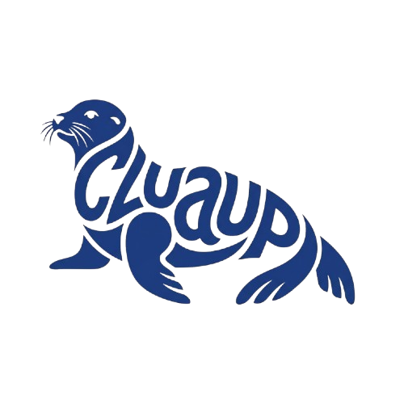

# Cluaupp

<p align="center">
  
</p>

**CL++ games on Roblox.** You write [CL++](https://kartzrbx.github.io/CLPP/). Cluaupp runs `clpp`, wires Rojo, and copies CluauppLibs.

[CL++ language](https://kartzrbx.github.io/CLPP/) · [Docs](https://kartzrbx.github.io/Cluaupp/) · [Why Cluaupp](https://kartzrbx.github.io/Cluaupp/why-cluaupp/) · [Benchmarks](https://kartzrbx.github.io/Cluaupp/benchmarks/) · [Roadmap](https://kartzrbx.github.io/Cluaupp/roadmap/)

[](https://www.npmjs.com/package/cluaupp)
[](https://nodejs.org)
[](LICENSE)

Cluaupp is the **Roblox project host** for [CL++](https://kartzrbx.github.io/CLPP/) — not the language compiler and not “roblox-ts with different syntax.” It turns **CL++ + project semantics** into a **validated Roblox project**, then emits Luau. [KartzRbx/CLPP](https://github.com/KartzRbx/CLPP) owns language, checker, Language Server (`clpp setup`), and codegen. Cluaupp owns Rojo/DataModel wiring, Context Safety, Flare remotes, API Registry (`cluaupp api generate`), and CluauppLibs. Optional Luau IntelliSense: **luau-lsp** + Rojo. Never `CL++ → roblox-ts → Luau`. Architecture: [`docs/.../product-pillars.md`](docs/src/content/docs/architecture/product-pillars.md).

Native PascalCase CluauppLibs: **Flare** net, **Sweep** zelador, **Spark** signal, **Keep** data, **Mint** numbers, **Axiom** math, **Roster** tables, **Gleam** UI, **Bloom** effects, **Lens** debug UI, **Crest** topbar, **Pin** billboard, **Stage** viewport 3D, **Coil** spring, **Helm** commands, **Shift** states, **Hive** ECS, **Ward** anti-cheat, **Ember** VFX, **Echo** replication, **Guide** tutorials, **Trace** pretty-print. Schemas pack u8 ids / ColorSequence / tables — never JSON on the hot path. Name map: [`runtime/SOURCES.md`](runtime/SOURCES.md).

```clpp
#include <clpp/roblox.clh>

struct HelloServer {
	void Greet(Player player);
};

void HelloServer::Greet(Player player) {
	post("Player name: " .: player.Name);
}

void init() {
	HelloServer hello;
	Players players = GetService<Players>();

	for (Player player in players.GetPlayers()) {
		hello.Greet(player);
	}

	players.PlayerAdded~>Connect(func (Player playerEntered) {
		hello.Greet(playerEntered);
	});
}
```

## Install

1. [Node.js](https://nodejs.org/) 18+
2. [Rojo](https://rojo.space/) **7.7.0**
3. **`clpp` 0.7.0+** on PATH from [CL++](https://github.com/KartzRbx/CLPP/releases) (`clpp-setup.exe` or `clpp setup`). Do not leave a cargo `clpp 0.1.0` first on PATH.

```bash
npm install -g cluaupp@latest
clpp setup
npx cluaupp init my-game
cd my-game
rokit install
cluaupp build
rojo serve
```

| Source | Output | Rojo |
| --- | --- | --- |
| `*.server.clpp` | `*.server.luau` | Script |
| `*.client.clpp` | `*.client.luau` | LocalScript |
| `*.clp` / untagged `.clpp` | `*.luau` | ModuleScript |
| `*.clh` | `*.luau` | ModuleScript |

## CLI

```bash
cluaupp init [folder]
cluaupp build [folder]
cluaupp watch [folder]
cluaupp language          # clpp api manifest
cluaupp intellisense      # schema highlighting (.flare .hive …) + clpp setup (CL++ LSP)
cluaupp api generate      # Registry → headers + lsp-index.json + lock
cluaupp target info       # schemaVersion, class/enum counts
cluaupp api aux-diff <p>  # optional coverage vs @rbxts/types / LuauTypes
```

**IntelliSense:** CL++ → `clpp` Language Server + Cluaupp `lsp-index.json`. Schemas (`.flare`/…) → Cluaupp editor extension. Emitted Luau → luau-lsp (optional). Cluaupp does not ship a Roblox class IntelliSense engine.

`clpp` missing? Set `CLPP` / `CLPP_PATH` or install [CL++ 0.7.0+](https://github.com/KartzRbx/CLPP/releases).

## Language

Course and reference: **[kartzrbx.github.io/CLPP](https://kartzrbx.github.io/CLPP/)**. Write `Player player` (never `Player*`). Default listen is `~>Connect`. Fire with `.Fire`. `@this` only inside `Class::Method`.

Exclusive CL++ (`guard`, `match`, `signal`, `observable`, `.:`, `::`, Fusion) is compiled by `clpp`. Samples: [`examples/game`](examples/game). Old C++ games: [migration](docs/src/content/docs/migration.md). Toolchain docs (Starlight): `npm run site:dev`.

## License

MIT
