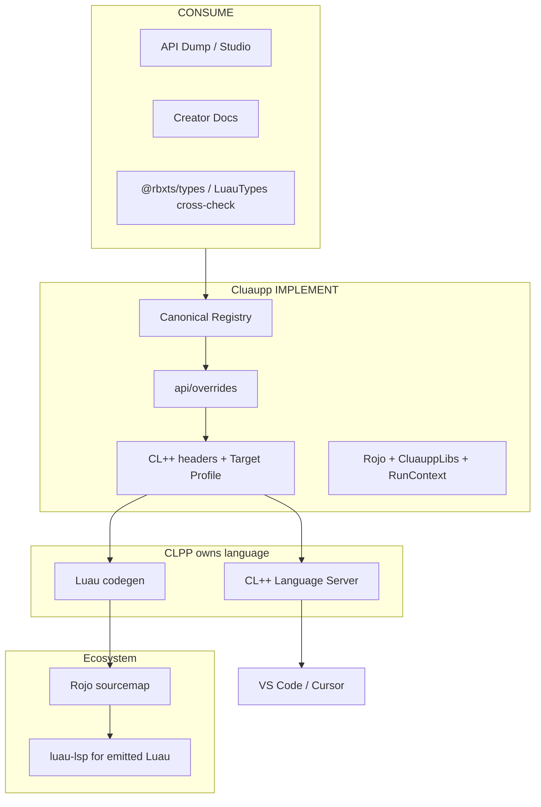

# Roblox Target (reuse-first)

**Cluaupp does not implement Roblox. Cluaupp integrates CL++ with the Roblox ecosystem.**

Product framing (pillars, killer combo, hard split): **[Product architecture](../product-pillars/)**.

CL++ is the language. Cluaupp is the **Roblox platform backend/SDK**: consume existing API sources → Canonical Registry → generate CL++ bindings and Target Profile metadata. IntelliSense, LSP, and Rojo sourcemaps stay with CLPP and the existing tooling stack.



## Reuse-first matrix

| Category | What | Action |
| --- | --- | --- |
| **CONSUME** | API Dump, Creator Docs YAML, version hashes | Loaders in `src/api/sources/` |
| **CONSUME (aux)** | `@rbxts/types`, LuauTypes / dumpRobloxTypes patterns | Coverage / gap diff only — **not** on the compile hot path |
| **CONSUME** | Rojo project + sourcemap | Existing Cluaupp build; CL++ LSP / luau-lsp read sourcemap — **no** `CluauppDataModelResolver` |
| **GENERATE** | Registry, CL++ headers, lock/manifest, Target Profile JSON | `cluaupp api generate` |
| **GENERATE (thin)** | Stable JSON index for the CL++ LSP (`api/generated/lsp-index.json`) | Data only — **not** an LSP protocol |
| **IMPLEMENT** | Overrides, identifier policy, GetService/RunContext, postprocess libs, Rojo wiring, CluauppLibs | Cluaupp only |
| **DO NOT BUILD** | LSP protocol, autocomplete engine, hover UI, go-to-def, official docs mirror, manual `Part`/`Model`/`Player` lists | Belongs to CLPP LSP + ecosystem |

JSON metadata is **not** IntelliSense by itself:

`API Metadata → Registry → CL++ Language Server (CLPP) → LSP → IDE`

Never: `CL++ → roblox-ts → Luau`. Never invent Roblox IntelliSense inside Cluaupp.

## Boundary (frozen)

| Layer | Owns | Does **not** own |
| --- | --- | --- |
| **CLPP** | Parser, AST, types, **Language Server**, Luau codegen | Roblox class lists, GetService semantics, Rojo, Studio |
| **Cluaupp** | Registry, Target Profile (`schemaVersion` 2), `.clh` bindings, Rojo, runtime, RunContext | LSP protocol, sourcemap resolver, Creator Docs clone |

## RobloxTargetProfile (`schemaVersion` 2)

Additive changes preferred within the same schema; breaking bumps `schemaVersion`. Lockfile: `api/roblox-api.lock.json`.

```bash
cluaupp api generate
cluaupp target info
cluaupp api coverage
cluaupp api verify
```

## Sources

| Source | Role |
| --- | --- |
| Mini-API-Dump / Studio dumps | Primary ingest |
| Creator Docs | Surface validation (consume, do not mirror) |
| LuauTypes / `@rbxts/types` | Optional coverage cross-check |
| `api/overrides/` | Auditable corrections (`reason` / `source` / `reviewAfter`) |

## Projections

Registry → CL++ headers (`include/clpp/…`) and optional Luau defs aligned for `luau-analyze` / luau-lsp. Headers are a **view**, not the source of truth. Official class docs: [create.roblox.com](https://create.roblox.com/docs).
