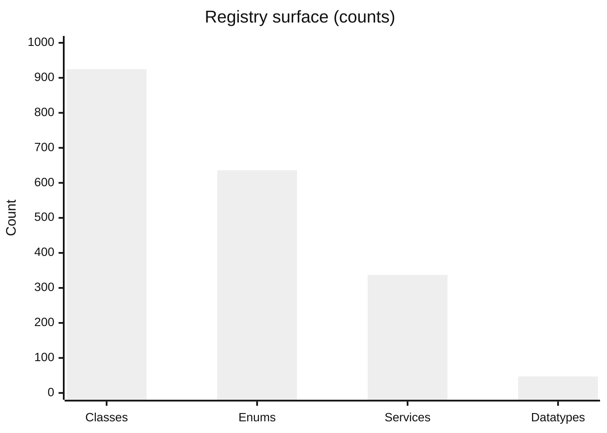
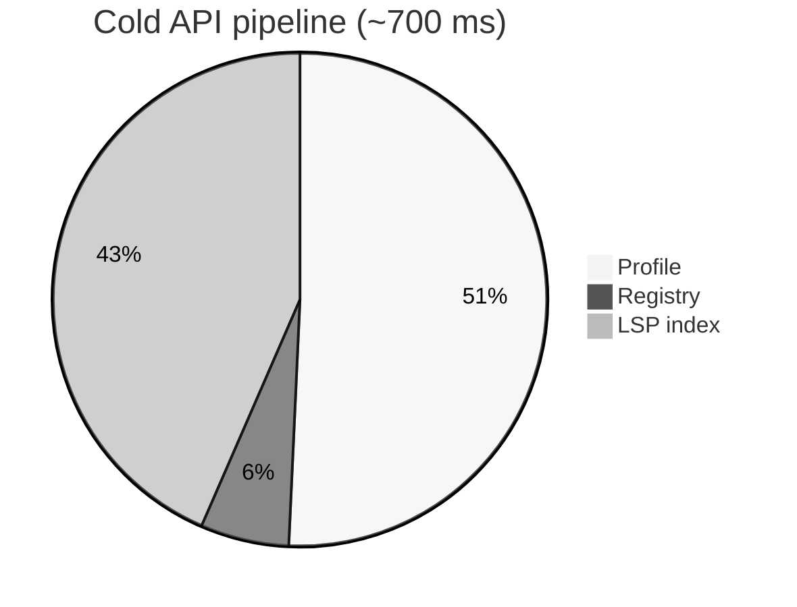
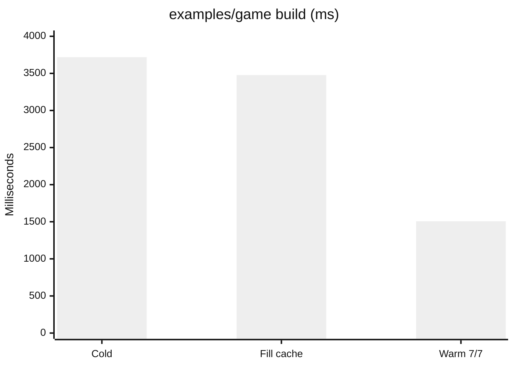

# Benchmarks

Numbers below were measured on a developer workstation (**Windows**, **Node v24.20.0**) against the shipped Mini-API-Dump and `examples/game`. Re-run anytime:

```bash
node scripts/bench-site.cjs
# writes api/generated/bench-latest.json
```

## Registry surface (authoritative dump)

| Metric | Value |
| --- | --- |
| Classes | **925** |
| Enums | **636** |
| Datatypes | **47** |
| Services | **337** |
| Properties | **4 070** |
| Methods | **3 282** |
| Events | **1 092** |
| Members with ThreadSafety | **~8 460** |

This is the **Canonical Registry** Cluaupp feeds into headers, `lsp-index.json`, and Context / Parallel analyzers — not a toy stub list.



## Cold-path API timings (same machine)

| Step | Time |
| --- | --- |
| Build `RobloxTargetProfile` | ~**350 ms** |
| Build O(1) registry indexes | ~**40 ms** |
| Build LSP index JSON | ~**300 ms** |
| **Total cold** | ~**700 ms** |

Warm rebuilds reuse disk cache under `api/normalized/` and `api/.cache/` when present. `cluaupp api verify` checks lock hashes without regenerating the world.



## Example game build (`examples/game`)

Measured with `cluaupp build` (async path, default jobs):

| Mode | Time | Notes |
| --- | --- | --- |
| Cold (`--no-incremental`) | ~**3.7 s** | Full transpile of 7 CL++ sources + schemas |
| Fill (first incremental write) | ~**3.5 s** | Writes `.cluaupp/compile-cache` |
| Warm (cache hit **7/7**) | ~**1.5 s** | Skip transpile; still sync vendor / write / prune |



Incremental cache lives under `.cluaupp/compile-cache`. Disable with `--no-incremental`. Parallel workers: `-j N` / `CLUAUPP_JOBS`.

## What these numbers mean for you

| Claim | Evidence |
| --- | --- |
| “Cluaupp knows the engine” | 900+ classes + ThreadSafety from the official dump |
| “Refreshable API” | `cluaupp api generate` / `diff` / `verify` |
| “Not a slow toy pipeline” | Sub‑1 s cold profile+index on a laptop-class machine |
| “Rebuilds get cheaper” | Warm cache ~**2.5×** faster than cold on the sample game |
| “Safety is not free text” | Context / DataModel / Parallel / Authority run **before** play |

## Honest non-claims

- These are **toolchain** benchmarks, not in-game FPS or Luau VM microbenchmarks.
- Parallel Luau **diagnostics** (`CLUAU-PAR*`) are **shipped** — they validate `parallel {}` / desync regions; they do not invent a faster runtime.
- SoA / buffer modules from `optimize --apply --layout` are **opt-in codegen**, not automatic FPS gains.
- We do **not** claim faster Luau than hand-written code; we claim **earlier catches** of illegal architecture and cheaper rebuilds.

See [Why Cluaupp](../why-cluaupp/) and [Product architecture](../architecture/product-pillars/).
